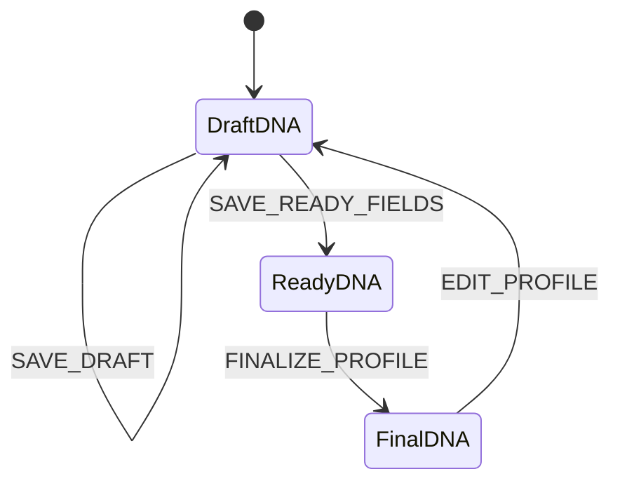
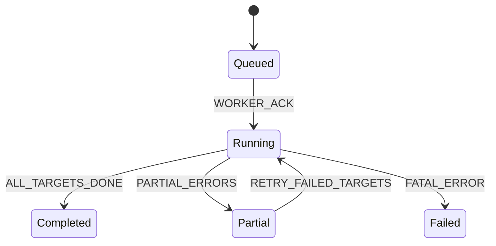
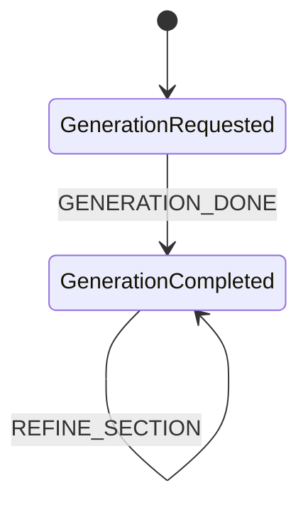
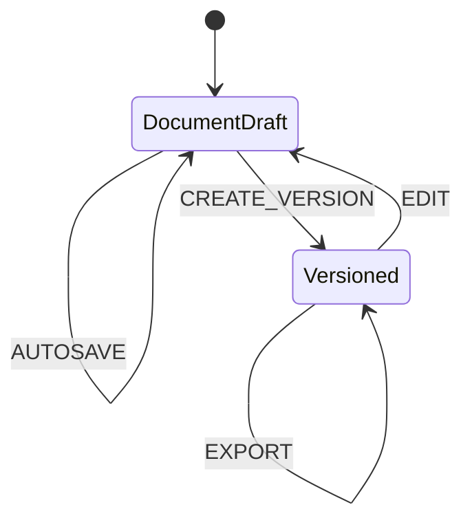
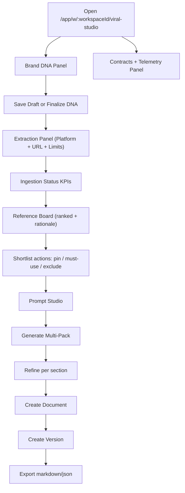

# Viral Brand Studio Plan 1

## Goal

Plan 1 establishes the module contract so every next phase can build against stable state machines, APIs, event names, and UI shells without redefining behavior.

## Module Information Architecture

1. Brand DNA onboarding (4-step structure)
2. Competitor extraction run launcher and status timeline
3. Reference ranking and shortlist controls
4. Prompt studio and generation shell
5. Document and versioning shell
6. Contracts + telemetry visibility panel

## API Contract (Plan 1)

All routes are workspace scoped and protected by portal auth + workspace membership.

1. `GET /api/portal/workspaces/:workspaceId/brand-dna`
2. `POST /api/portal/workspaces/:workspaceId/brand-dna`
3. `PATCH /api/portal/workspaces/:workspaceId/brand-dna`
4. `GET /api/portal/workspaces/:workspaceId/viral-studio/contracts`
5. `GET /api/portal/workspaces/:workspaceId/viral-studio/ingestions`
6. `POST /api/portal/workspaces/:workspaceId/viral-studio/ingestions`
7. `GET /api/portal/workspaces/:workspaceId/viral-studio/ingestions/:ingestionId`
8. `GET /api/portal/workspaces/:workspaceId/viral-studio/references`
9. `POST /api/portal/workspaces/:workspaceId/viral-studio/references/shortlist`
10. `POST /api/portal/workspaces/:workspaceId/viral-studio/generations`
11. `GET /api/portal/workspaces/:workspaceId/viral-studio/generations/:generationId`
12. `POST /api/portal/workspaces/:workspaceId/viral-studio/generations/:generationId/refine`
13. `POST /api/portal/workspaces/:workspaceId/viral-studio/documents`
14. `GET /api/portal/workspaces/:workspaceId/viral-studio/documents/:documentId`
15. `POST /api/portal/workspaces/:workspaceId/viral-studio/documents/:documentId/versions`
16. `POST /api/portal/workspaces/:workspaceId/viral-studio/documents/:documentId/export`

## State Transition Map

## UX Flow Map (Editorial Gradient Direction)

## Telemetry Taxonomy (Plan 1 baseline)

1. `viral_studio_onboarding_viewed`
2. `viral_studio_brand_dna_saved`
3. `viral_studio_brand_dna_finalized`
4. `viral_studio_ingestion_started`
5. `viral_studio_ingestion_completed`
6. `viral_studio_ingestion_failed`
7. `viral_studio_reference_shortlisted`
8. `viral_studio_generation_requested`
9. `viral_studio_generation_completed`
10. `viral_studio_generation_refined`
11. `viral_studio_document_created`
12. `viral_studio_document_version_created`
13. `viral_studio_document_exported`
14. `viral_studio_contracts_viewed`

## Component Inventory (Plan 1)

1. Hero / module intro
2. Brand DNA multi-step form shell
3. Extraction form and run KPI cards
4. Ranked references list with shortlist controls
5. Prompt textarea and generation output viewer
6. Document actions (create, version, export)
7. Contracts and telemetry summary widget

## Next Phase Hand-off Notes

1. Replace synthetic ingestion/reference generation with real orchestrator jobs.
2. Persist all entities in database models.
3. Add SSE or websocket status stream for ingestion and generation.
4. Add full editor interactions for document section ordering and inline edits.
5. Keep chat runtime as the central operating surface and pipe Viral Studio outputs into active chat branches.
