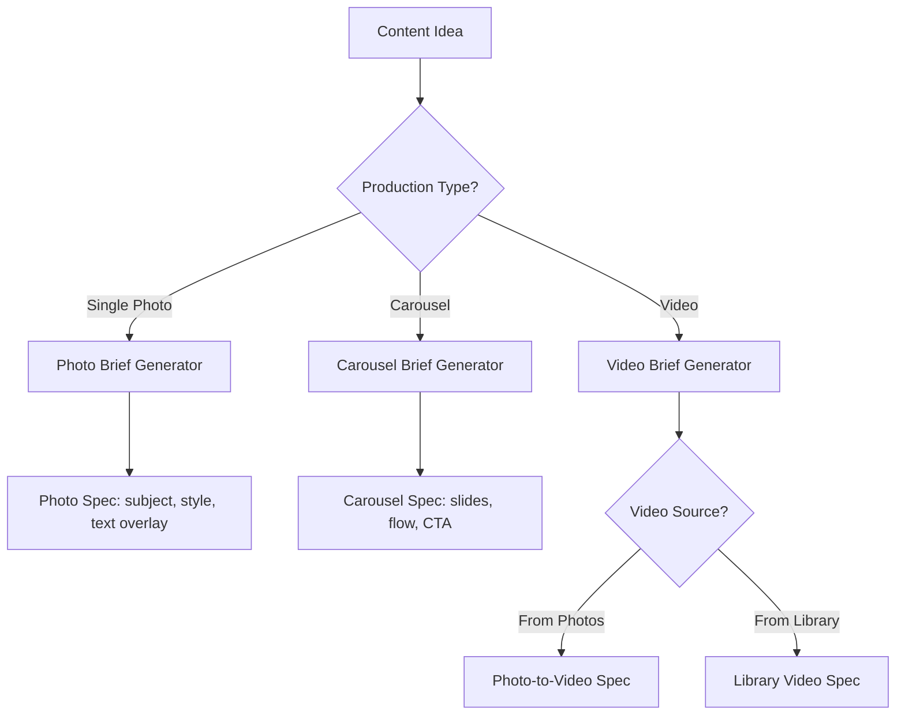

# Instagram Agency AI Workflow - Implementation Plan

## Overview
Transform the current placeholder-based n8n workflow into a fully functional content creation automation system for **@ummahpreneur**. The workflow will analyze client and competitor content to generate actionable production briefs.

## User Review Required

> [!IMPORTANT]
> **API Credentials Needed**: This workflow requires Apify and OpenAI API keys to function. Please provide these before execution.

> [!WARNING]  
> **Video Library Integration**: For video production using your own library, we need to know:
> - Where is the video library stored? (Google Drive, SharePoint, local folder?)
> - What format should video references be in?

---

## Proposed Changes

### Phase 1: Input Configuration

#### [MODIFY] [Instagram Agency AI Workflow.json](file:///Users/ibrahimgamal/Downloads/ali/upwork/n8n-agency/Instagram%20Agency%20AI%20Workflow.json)

Replace the entire workflow with a production-ready version containing:

**1.1 Input Data Node** - Define all required inputs:
```json
{
  "client_account": "ummahpreneur",
  "competitors": [
    "_amrouz",
    "islam4everyone_",
    "thesunnahguy",
    "taemann__",
    "bepositive_bedifferent",
    "zeemrc",
    "harristory_"
  ],
  "posts_limit": 12,
  "days_back": 30
}
```

---

### Phase 2: Data Ingestion

**2.1 Apify Client Scraper** - Scrape @ummahpreneur's last 30 days:
- Posts, reels, carousels
- Engagement metrics (likes, comments, saves)
- Post types and media URLs

**2.2 Apify Competitor Scraper** - Loop through competitor list:
- Same data points as client
- Split by "really good" vs standard competitors

**2.3 Data Cleaner Node** - Process scraped data:
```javascript
// Categorize content into production types
const posts = $input.all();
const categorized = {
  single_photos: [],
  carousels: [],
  videos: [],
  reels: []
};

for (const post of posts) {
  const item = post.json;
  if (item.type === 'Video' || item.type === 'Reel') {
    categorized.videos.push({
      ...item,
      productionType: 'video',
      mediaCount: 1
    });
  } else if (item.childPosts && item.childPosts.length > 1) {
    categorized.carousels.push({
      ...item,
      productionType: 'carousel',
      mediaCount: item.childPosts.length
    });
  } else {
    categorized.single_photos.push({
      ...item,
      productionType: 'single_photo',
      mediaCount: 1
    });
  }
}
return [{json: categorized}];
```

---

### Phase 3: Content Analysis

**3.1 Client Content Analysis (OpenAI)**

Analyze client's historical content to extract:

| Analysis Type | Purpose |
|---------------|---------|
| Visual Style | Colors, filters, composition patterns |
| Text Overlays | Fonts, positioning, animation style |
| Transition Style | For videos - timing, effects used |
| Hook Patterns | First 3 seconds of videos, first line of captions |
| Content Pillars | Topics that resonate most |

**3.2 Video Style Extractor** - For video production matching:
```javascript
// Extract styling instructions from client videos
const stylingGuide = {
  transitionStyle: "fast cuts, 0.3s transitions",
  textOverlay: "bold white Arabic text, centered",
  musicStyle: "nasheed, no drums",
  aspectRatio: "9:16 for reels, 1:1 for feed",
  averageDuration: "15-30 seconds",
  hookPattern: "question or bold statement in first 3s"
};
```

**3.3 Competitor Analysis (OpenAI)**

Using GPT-4 Vision to analyze competitor visuals:
- What makes @_amrouz content stand out
- Common patterns across successful posts
- Gap analysis vs client's current content

---

### Phase 4: Production Specification Generator

**4.1 Production Type Router** - Route to appropriate brief generator:



**4.2 Production Brief Templates**

**Single Photo Brief:**
```json
{
  "type": "single_photo",
  "subject": "Quote about Islamic business ethics",
  "visualStyle": "Dark elegance with gold accents",
  "textOverlay": "Arabic quote + English translation",
  "requiredElements": ["logo watermark", "CTA in caption"],
  "referencePost": "link to similar client post"
}
```

**Carousel Brief:**
```json
{
  "type": "carousel",
  "slideCount": 7,
  "slides": [
    {"position": 1, "content": "Hook - attention grabbing first slide"},
    {"position": 2, "content": "Problem statement"},
    {"position": "3-6", "content": "Value slides"},
    {"position": 7, "content": "CTA + follow reminder"}
  ],
  "visualFlow": "consistent background, each slide builds on previous"
}
```

**Video Brief (from photos):**
```json
{
  "type": "video_from_photos",
  "photos": ["url1", "url2", "url3"],
  "stylingInstructions": {
    "transitions": "zoom-in, 0.3s each",
    "textAnimation": "fade-in from bottom",
    "duration": "15 seconds",
    "music": "reference audio from library"
  },
  "referenceVideo": "link to client video for style matching"
}
```

**Video Brief (from library):**
```json
{
  "type": "video_from_library",
  "libraryClips": ["clip_id_1", "clip_id_2"],
  "editingInstructions": {
    "narrative": "Storytelling flow",
    "voiceover": true,
    "captions": "auto-generated Arabic"
  }
}
```

---

### Phase 5: Content Calendar Generator

**5.1 Weekly Schedule Builder:**
- Generate 7-day content calendar
- Mix of production types based on analysis
- Each item links to full production brief

**5.2 Output Format:**

| Day | Post Type | Production Type | Brief Link | Caption Draft |
|-----|-----------|-----------------|------------|---------------|
| Mon | Reel | video_from_photos | [Brief #1] | Hook: "..." |
| Tue | Carousel | carousel_7_slides | [Brief #2] | Educational... |
| Wed | Single | single_photo | [Brief #3] | Quote post... |

---

## Verification Plan

### Automated Tests
Since this is an n8n workflow JSON file, automated testing is limited. We will verify:

1. **JSON Validity**: Parse the workflow file to ensure valid JSON structure
   ```bash
   cat "Instagram Agency AI Workflow.json" | jq .
   ```

2. **Node Connections**: Verify all nodes are properly connected (no orphaned nodes)

### Manual Verification (Requires User)

> [!NOTE]
> **To fully test this workflow, you will need to:**
> 1. Import the workflow into n8n
> 2. Add your Apify API credentials to n8n
> 3. Add your OpenAI API credentials to n8n
> 4. Run the workflow manually and verify each step

**Testing Steps:**
1. Import workflow JSON into n8n
2. Configure credentials for Apify and OpenAI
3. Run with test data (sample Instagram posts)
4. Verify output contains production briefs for each content type

---

## Waiting On User

Before I can implement the full workflow:

1. **Apify API Token** - Required for Instagram scraping
2. **OpenAI API Key** - Required for vision analysis and content generation
3. **System Prompts** - Any specific persona or instructions for the AI agents
4. **Video Library Details** - Location and access method for video production assets


/Users/ibrahimgamal/.gemini/antigravity/brain/cccbe6c7-9ba6-41f5-8f5d-c1dd72fc1ac7/implementation_plan.md.resolved